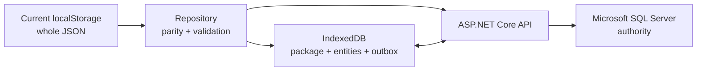

# Database Master Plan

## Persistence path

Current localStorage/XML remain unchanged during parity. IndexedDB and SQL migrations require separate gates. Sources: `../STATE_SCHEMA.md`, `../safe-mode/SYNC_DATA_SCHEMA.md`, and `../../../database/`.

## Keys and lifecycle

- SQL internal PK: bigint/int identity where appropriate.
- Stable sync ID: UUID/uniqueidentifier usable offline.
- CompetitionId: mandatory tenant scope.
- Public code: current `1.x`, `2.x`, `3.x`, sheet codes retained for humans, never sole relational key.
- OperationId: globally unique idempotency key.
- Version: SQL `rowversion`, opaque to clients.
- Synchronized deletion: soft-delete/tombstone; hard-delete only after retention/reconciliation.

## Entity plan

| Entity | Current | Future SQL | Sync | Keys/version | Delete | Audit |
|---|---|---|---|---|---|---|
| Competition/settings | `state.settings` | `competitions` | Package + protected config ops | PK/public_code/rowversion | Archive | Every rule/date/stage change |
| Stages/events | settings/events | `stages`, `competition_stages`, `events`, `competition_events` | Package + versioned enablement | lookup/composite + rowversion | Disable/tombstone | Enable/order/round changes |
| Cutoffs/divisions | arrays/names | `division_cutoffs`, `divisions` | Package + versioned config | sync ID + scoped uniqueness + rowversion | Tombstone | Before/after + recalculation impact |
| Organizations | stacker text | `organizations` | Normal entity sync | PK/sync ID/rowversion | Merge/archive | Merge/name/location |
| Stackers | `stackers[]` | `stackers` | Package + CRUD | PK/sync ID/bib_code/rowversion | Tombstone | Identity, DOB, special, division, check-in/payment, delete |
| Check-in | `checkedIn` | field or check-in events | High-frequency monotonic command | stacker/version or event ID | Reversal | Station/user/device/reason |
| Payment | `paid`, `amt` | new payment/registration ledger | Protected financial command | payment ID/rowversion | Void/reversal | Full status/amount/reference |
| Teams | doubles/relays | `teams` | Package + CRUD | PK/sync ID/team_code/rowversion | Tombstone | Name/type/division/delete |
| Membership | member codes/arrays | `team_members` | Ordered dependent ops | membership ID or composite/version | Tombstone/end | Roster/order/conflict |
| Time sheets | generated | `time_sheets` | Package/status | PK/sync ID/sheet_code/rowversion | Void/archive | Generation/status/reassignment |
| Results | `results[]` | `results` | Protected/idempotent | PK/sync ID/rowversion | Void/tombstone | Complete official history |
| Attempts/scratches | attempts array/999 | `result_attempts` | Protected per attempt | PK/result+attempt/rowversion | Scratch/void, no erase | Raw value/operator/device/reason |
| Placements/finalists | calculated | calculation/outcome model TBD | Server-authoritative | source/calculation version | Recalculate | Inputs, algorithm, overrides |
| Awards | `awards` | new award plan tables | Versioned config | scoped category/rowversion | Archive version | Plan and quantity impact |
| Translations | dictionaries | new translations table | per language/key | competition+language+key/version | Tombstone/fallback | Old/new/editor |
| Leaderboard | aggregate | `leaderboard_settings` | Package/config | Competition PK/rowversion | Reset/archive | Config changes |
| Users/sessions | local display | `users`, `user_sessions` | Online authority/minimal offline claim | identity/session IDs | Deactivate/expire | Role/session/device |
| Devices | none | new `devices` | Origin/assignment | DeviceId/rowversion | Revoke | Register/assign/revoke |
| Notifications | array | `notifications` + read model | Incremental | PK/sync ID/version | Retention | Create/read if required |
| Paperwork jobs | generated | `paperwork_jobs` | Usually telemetry | PK/options hash | Archive | Generator/options/time |
| Sync operations | none | new `sync_operations` | Idempotency authority | CompetitionId+OperationId | Retain | Request hash/outcome/version |
| Change feed | none | new `change_feed` | Checkpoint/tombstones | competition sequence | Retention | Entity/version/change |
| Conflicts | none | new `conflicts` | Review lifecycle | ConflictId/op/entity | Immutable history | Both values/reviewer/reason |
| Audit | limited local | new `audit_events` | Offline upload then authority | AuditId/sequence | Retention, immutable | Actor/device/op/before-after |
| Packages | bundled import | new `competition_packages` | Manifest/checkpoint | PackageId/version | Expire/archive | Generate/download/activate |

## SQL Server requirements

- Convert conceptual schema to reviewed SQL Server/EF Core migrations.
- Add rowversion to mutable authoritative records; timestamps do not replace concurrency tokens.
- Composite competition-scoped indexes/uniqueness and restrictive foreign keys.
- Commit mutation, idempotency outcome, audit, and change-feed entry in one transaction.
- Never cascade-delete official results/audit.
- Encryption, least privilege, migration rollback, monitoring, integrity reconciliation, HA and tested backups with approved RPO/RTO.

## Mapping rules

Repository—not UI—maps current JSON/XML to entities. IndexedDB stores entity projections and sync envelopes, not a whole-state last-write-wins document. API resolves public codes to authorized internal IDs. Derived age/division/official time/placement authority and calculation version must be approved before migration.

## Open decisions

Identity/auth and offline claims; UUID strategy; payment ledger; award/translation schema; change-feed technology/retention; audit retention; hosting/HA/RPO/RTO; privacy obligations; placement storage versus recalculation.
