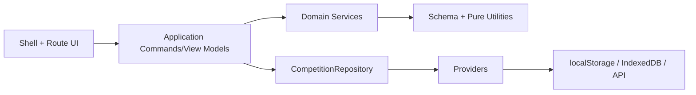

# Module Dependency Map

## Dependency law

Dependencies flow downward only. Cross-domain reads use narrow interfaces; no cycles.

## Planned modules

| Module | Responsibilities | Dependencies/services | Repository/provider/API usage |
|---|---|---|---|
| App Shell/Router | Hash route, shell, module lifecycle, status area | Route modules, Translation UI | No provider; Repository status only through app coordinator |
| Dashboard UI | Metrics/notifications view | Query/view model services | Repository queries; no provider/API direct |
| Settings UI | Forms/events/divisions settings | SettingsService, DivisionService | Repository commands/queries |
| Language UI | Translation editor | TranslationService | Repository translation commands |
| Stackers UI | Register/edit/search/import | StackerService, DivisionService | Repository commands/queries/import coordinator |
| Doubles UI | Team form/membership | TeamService | Repository team commands |
| Relay UI | Relay form/members | TeamService | Repository team commands |
| Competition UI | Prelim/final entry | ResultService, FinalsService | Repository protected commands |
| Awards UI | Plan/config/summary | AwardService | Repository award config commands |
| Reports UI | Filters/tables/exports | ReportService | Repository read/query models |
| Print UI | Preview/print invocation | PrintDocumentService | Repository reads; browser print adapter only |
| Leaderboard UI | Display/config | LeaderboardService | Repository query/config commands |
| Users/Access UI | User/device/session views | Authorization/application service | Future API through Repository/application boundary |
| StateNormalizer | Defaults/compatibility/reference validation | schema, Division/Team/Result pure policies | Used by Repository; no provider direct |
| SettingsService | Settings/events/stages/advance policy | schema/event catalog | No provider/API; pure |
| DivisionService | Age/division generation/assignment/sort | date utilities/config | No provider/API; pure |
| StackerService | CRUD validation, IDs, import mapping, cascade plan | DivisionService, Team/Result reference readers | Produces commands; no provider direct |
| TeamService | Doubles/Relay membership, conflict, completion/division | DivisionService, stacker reader | Produces commands; no provider direct |
| ResultService | Compact IDs, time/scratch, prelim, ranking | Settings, participant readers | Produces protected commands; no provider direct |
| FinalsService | Sheets, qualifiers, attempts, placements/ties | Result, Settings, Division | Produces protected commands; no provider direct |
| AwardService | Planned quantities/config/export model | Settings, Division | Produces config command/query model |
| ReportService | Competition/admin datasets/filter/group/sort | Read-only domain projections | Repository queries only through application layer |
| PrintDocumentService | Domain -> print document models | Settings, participants, Finals, Translation | No provider; receives data |
| TranslationService | Packs/keys/overrides/completeness | default dictionaries | Pure; persistence via Repository command |
| LeaderboardService | Select/rank/limit display model | Result, participant readers | Pure; persistence via Repository |
| CompetitionRepository | Application persistence/mode boundary | normalizer, serializers, providers, monitor | Sole provider consumer; future API indirect via Online provider |
| LocalStorageProvider | Current-key JSON parity transition | browser storage | localStorage only; never business/UI |
| OnlineApiProvider | Authenticated transport/contracts | HTTP/auth/serializer/telemetry | Sole client API transport; no decisions |
| IndexedDbProvider | Package/entity/outbox/checkpoint/conflict/audit transactions | IndexedDB/schema/hash/clock | Browser IndexedDB only |
| SyncEngine | Pull/apply/push/ack/retry/resume/lease | Online/IndexedDB providers, resolver, monitor | Uses providers directly as infrastructure orchestrator; no UI/domain rule |
| ConnectivityMonitor | Verified network/API/auth/version status | browser hint + API health | Health endpoint only |
| ConflictResolver | Policy classification/review operation | policy registry, comparisons, auth/audit | Reads/writes through Sync/Repository contracts; no storage direct |
| EmergencyBackupService | Encrypted verified backup/recovery staging | IndexedDB provider, crypto/file/audit | No authoritative overwrite/API bypass |
| XML Serializer | Exact compatibility import/export | schema/normalizer escaping | Repository only; no UI/provider direct |
| Pure Utilities | dates, IDs, escape, CSV, grouping, formatting | none | No state/DOM/storage/API |

## Server modules

| Module | Responsibility | Allowed dependencies | Forbidden |
|---|---|---|---|
| API Endpoints | HTTP contracts/correlation/status | Application handlers, auth | EF/SQL/domain duplication |
| Authentication/Authorization | Identity, roles/capabilities, device/competition access | Identity infrastructure/policies | UI trust, offline record as authority |
| Application Commands | Scope, authorize, orchestrate transaction/idempotency | Domain, repositories/unit of work | HTTP/DOM/client state |
| Application Queries | Competition-scoped read models | read repositories | cross-competition unscoped query |
| Domain | Official rules/invariants | pure types/policies | EF Core, HTTP, browser concepts |
| Infrastructure | EF Core, SQL, packages, audit/change feed | Application interfaces | business-rule ownership |
| Sync API | Package/checkpoint/operations/conflicts | Application commands/queries | LWW official result logic |

## Forbidden dependencies

1. UI -> localStorage, IndexedDB, fetch, SQL, provider.
2. Business service -> DOM/window/alerts/print/download/storage/HTTP.
3. Provider -> business rules, UI, route state.
4. Repository -> UI/route module.
5. Report/print -> duplicated ranking/division/finals rules.
6. Client -> direct SQL or trusted authorization decisions.
7. ASP.NET endpoint -> duplicated domain rules or unscoped EF queries.
8. Offline store -> independent authority or silent official-result merge.
9. XML compatibility -> sync metadata/schema changes without approval.

## Enforcement

Use lint/import-boundary rules after modularization, architecture tests server-side, code-review checklist, explicit interfaces, and dependency diagrams updated incrementally. Violations require a decision or correction before merge.
