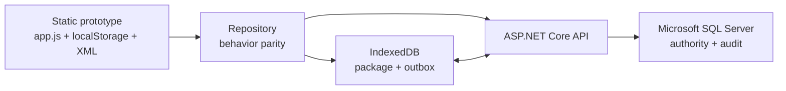
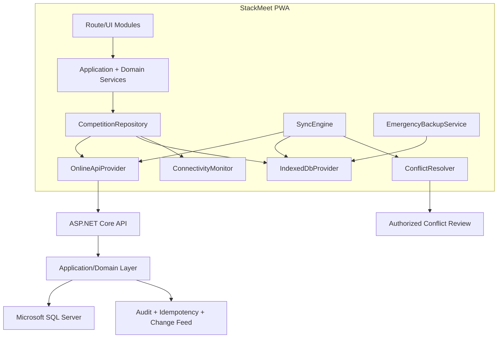
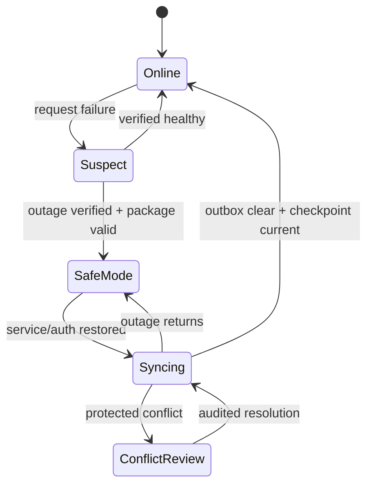
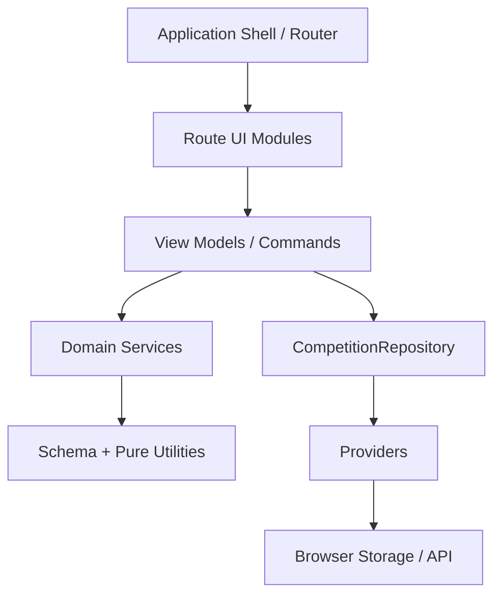
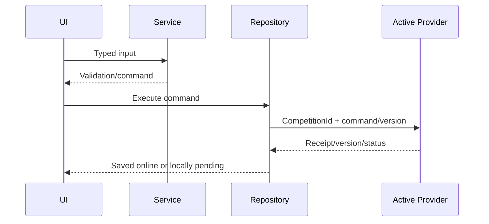
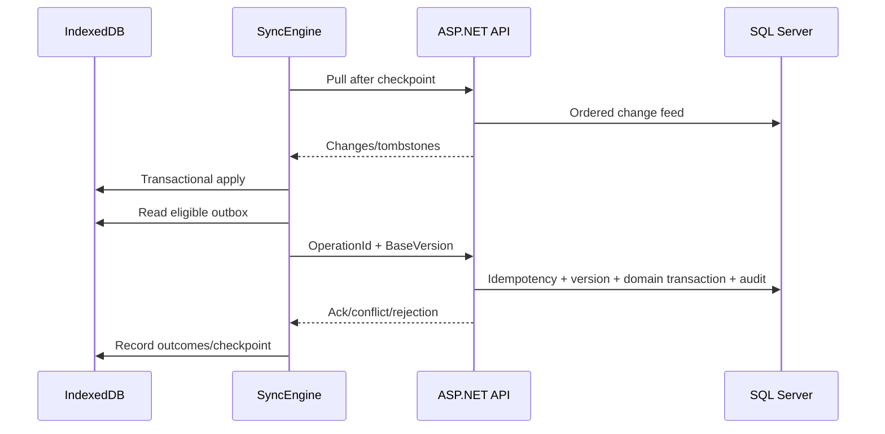

# StackMeet System Architecture v1

**Status:** Authoritative baseline | **Version:** 1.0 | **Date:** 2026-07-11

## Primary entry point

This is the primary architectural entry point from Sprint 5. Existing documents remain supporting specifications: `../../../ARCHITECTURE_REVIEW.md`, `../STATE_SCHEMA.md`, `../SERVICES_DESIGN.md`, `../MODULE_ROADMAP.md`, `../CODING_STANDARDS.md`, `../MIGRATION_PLAN.md`, all `../safe-mode/` specifications, `../CTO_DECISIONS.md`, and `../../../database/`. They are preserved, not replaced. If sources appear inconsistent, stop and obtain a stable decision.

## Vision and principles

StackMeet becomes an online-first competition operations PWA using ASP.NET Core and Microsoft SQL Server, with Competition Safe Mode for temporary outages. Priorities: official-result integrity, competition isolation, durable writes, audit, recovery, and incremental migration.

1. Preserve behavior until separately approved.
2. UI calls services/repository, never providers/storage.
3. SQL authority remains Proposed under CTO-002; offline stores are replicas/queues.
4. Scope every hosted operation by internal CompetitionId.
5. Never silently overwrite official result conflicts.
6. Implement each deterministic business rule once, DOM-free and tested.
7. Version, test, approve, and make reversible every storage/XML/schema migration.
8. Offline save means durable IndexedDB entity + outbox + audit, not server sync.

## Platform evolution

Each arrow is gated: characterize, implement beside legacy, shadow-compare, migrate one boundary, validate, and retain rollback.

## Target architecture

## Operating modes

**Online:** Repository submits authenticated idempotent commands. API performs authorization, rule validation, SQL transaction, audit/idempotency, and returns Version/checkpoint.

**Competition Safe Mode:** after verified outage or authorized activation, Repository reads one valid competition package. Each local mutation atomically writes projection, immutable outbox operation, and local audit. UI distinguishes locally saved from synchronized.

**Syncing:** SyncEngine pulls changes/tombstones, classifies conflicts, pushes eligible operations, records acknowledgements, and verifies checkpoint. Protected results require authorized review.

## Repository and provider architecture

CompetitionRepository is the only application persistence boundary. It coordinates mode, validation, normalizers, providers, receipts, and compatibility serializers.

- LocalStorageProvider: transition-only parity adapter for current JSON.
- OnlineApiProvider: authenticated HTTP transport; no business decisions.
- IndexedDbProvider: packages, entities, outbox, checkpoints, tombstones, conflicts, audit.

No UI/domain code calls localStorage, IndexedDB, fetch, or SQL. Detailed contracts: `../safe-mode/PROVIDER_INTERFACES.md`.

## Service and module architecture

Planned services: StateNormalizer, Settings, Division, Stacker, Team, Result, Finals, Award, Report, PrintDocument, Translation, and Leaderboard. They accept explicit inputs, contain no DOM/storage/HTTP, and implement rules once.

Forbidden: provider -> service/UI, domain -> UI/DOM, repository -> route, utility -> stateful domain, UI -> provider/storage.

## Data flow

## Synchronization flow

Completion requires current checkpoint, durable acknowledgements, no eligible pending/deferred operations, no blocking conflict, and integrity checks. Detailed protocol: `../safe-mode/SYNC_PROTOCOL.md`.

## Future ASP.NET Core architecture

- API: endpoints, authentication, contracts, correlation, rate limits.
- Application: competition-scoped commands/queries, policies, transactions, idempotency.
- Domain: stacking rules/invariants, no EF/HTTP dependency.
- Infrastructure: EF Core/SQL Server, identity, audit, change feed, packages, telemetry.

Every command authenticates user/device, obtains authorized CompetitionId, validates BaseVersion, and commits mutation + audit + idempotency atomically.

## Future SQL Server architecture

The current schema is conceptual, not final SQL Server DDL. Retain core entities and add stable sync IDs, `rowversion`, tombstones, devices, sync operations, change feed, audit, conflicts, packages, and award/translation models. Avoid cascades that erase official history. See `DATABASE_MASTER_PLAN.md`.

## Future PWA architecture

HTTPS app shell and manifest; service worker caches static/versioned shell, not authoritative data. IndexedDB stays behind Repository. Enforce client/package/API compatibility before protected writes, safe update policy during competition, storage/quota readiness, offline startup, device identity, telemetry, and rollback.

## Governance and Sprint 5 gate

Decision changes require Product Owner instruction. First create executable characterization tests for storage/XML and critical rules. Implement Repository parity in tests, then migrate one call per approved stage. Safe Mode follows approval of CTO-001–007 and separate security/package/version gates.
