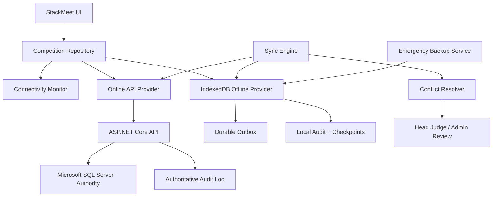
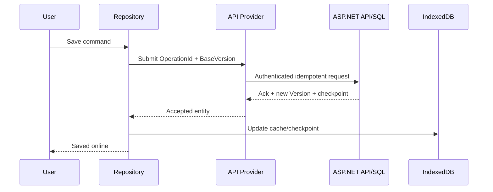
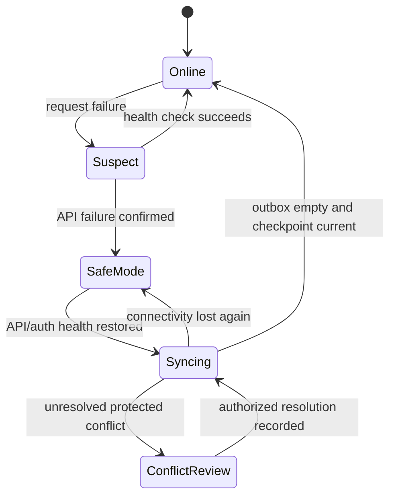

# Competition Safe Mode Architecture

## Objective and invariants

StackMeet is online-first through an ASP.NET Core API backed by Microsoft SQL Server. Competition Safe Mode is a controlled continuity mechanism for temporary loss of internet or API availability. It is not an independent multi-master system.

Invariants:

- SQL Server is the authoritative central database.
- Offline data is scoped to one downloaded competition package.
- Every offline mutation enters a durable IndexedDB outbox before the UI reports it saved.
- Official result conflicts are never silently overwritten.
- Device, user, competition, operation, version, and time are auditable.
- Existing browser JSON/XML formats remain unchanged until separately migrated.

## Operating modes

### Online Mode

Repository reads/writes through OnlineApiProvider. IndexedDB maintains a current checkpoint/cache and records acknowledgements. Server validation, authorization, transactions, rowversion, and audit are authoritative.

### Competition Safe Mode

Entered automatically after verified API failure or manually by an authorized user. Reads use the downloaded IndexedDB package. Writes are applied locally in one transaction with an outbox operation. The UI shows offline status, package age, device identity, and pending count.

### Syncing Mode

Connectivity has returned, but local work is not yet fully acknowledged. The Sync Engine first downloads server changes since the checkpoint, detects conflicts, uploads safe outbox operations in deterministic order, records acknowledgements, and repeats until both sides share a checkpoint. Users may continue only where entity policy permits.

## Components

- **CompetitionRepository:** one application-facing read/write boundary; selects provider by mode and enforces durable-local-write semantics.
- **OnlineApiProvider:** authenticated ASP.NET Core API client; sends idempotent commands and checkpoint queries.
- **IndexedDbProvider:** competition package, entity stores, outbox, tombstones, checkpoints, device metadata, conflicts, and audit cache.
- **SyncEngine:** pull/compare/push/ack/checkpoint orchestration; restartable state machine.
- **Outbox queue:** immutable operation envelopes with unique IDs, base versions, dependency/order metadata, attempts, and status.
- **ConnectivityMonitor:** distinguishes browser network hints from verified API health/auth state.
- **ConflictResolver:** entity-policy classification; auto-merges only approved low-risk fields and routes official conflicts for review.
- **Audit logging:** server audit is authoritative; local audit records offline actions and sync decisions until acknowledged.
- **EmergencyBackupService:** encrypted/exportable package plus outbox/checkpoint/conflicts for recovery; never an automatic overwrite mechanism.

## Component architecture



## Online write sequence



## Safe Mode local write sequence

```mermaid
sequenceDiagram
  participant U as User
  participant R as Repository
  participant I as IndexedDB transaction
  U->>R: Save command
  R->>I: Write entity + outbox + local audit atomically
  I-->>R: Durable commit
  R-->>U: Saved locally; pending sync
```

## Recovery and synchronization sequence



## Connectivity rules

`navigator.onLine` is only a hint. Mode changes require API health checks with timeout and reason codes: internet unavailable, DNS/TLS failure, API unavailable, authentication expired, competition locked, or incompatible client/package version. Authentication failure must not be mislabeled as offline.

## Audit model

Each mutation records operation ID, competition ID, entity/type, before/base version, intended change, device ID, user ID/access, client time, server receipt time, status, and resolution. Conflict decisions record reviewer, reason, compared values, and resulting version. Audit events are append-only.

## Emergency backup and recovery

- Export package manifest, entity snapshot, outbox, tombstones, checkpoints, conflicts, audit cache, app/schema versions, and hashes.
- Encrypt sensitive content; require authorized recovery access.
- Never restore directly over central data. Import into a recovery review workflow, validate competition/package/device, replay idempotently, and require approval for protected conflicts.
- Keep at least two verified backups during active finals: device-local and removable/authorized secondary storage where policy permits.

## Failure containment

- One IndexedDB transaction per local entity/outbox/audit write.
- No outbox deletion until server acknowledgement is durably recorded.
- Sync is resumable after tab/browser/device restart.
- A stale/incompatible package becomes read-only until refreshed or explicitly authorized for emergency continuation.
- Multiple offline devices use designated data ownership in the initial rollout to minimize conflicting writes.

