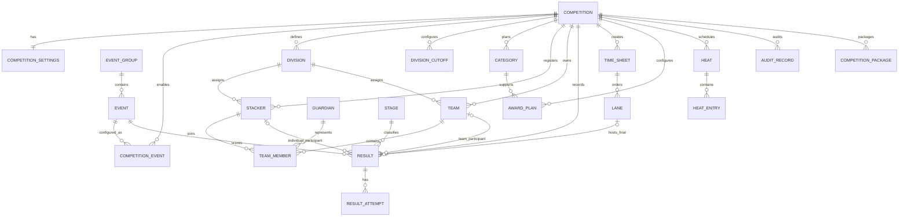

# Entity Relationship Model

This is a proposed target model. `CompetitionId` is the mandatory foreign-key scope for every competition-owned record.

## Cardinality and foreign-key rules

| Relationship | Cardinality | Proposed foreign key / constraint |
|---|---|---|
| Competition → child entity | 1:M | each child has non-null `competition_id`; all access is scoped by it. |
| Competition ↔ Event | M:N | `competition_events(competition_id,event_id,event_group_id)` composite key. |
| Stacker ↔ Team | M:N | `team_members(team_id,stacker_id)`; uniqueness policy enforced by TeamService per team type. |
| Team ↔ Guardian | 0..M / 0..1 per membership | `team_members.guardian_id` allowed only for Child/Parent membership. |
| Result → participant | exactly one | check constraint: one of `stacker_id`, `team_id` is present. |
| Result → attempts | 1:M | `result_attempts.result_id`; attempt ordinal unique per result. |
| Final sheet → lane → final result | 1:M / 0..1 | `sheet_lanes(time_sheet_id,lane_number)` unique; optional `result_id`. |
| Competition ↔ Official | M:N | `competition_roles(competition_id,user_id,role)` unique. |
| Competition → audit/package | 1:M | retain historical rows; no destructive cascade for protected records. |

## Referential integrity policy

Use restrictive deletes for results, attempts, packages and audit records. Soft-delete competition-owned operational records where historical results or references exist. Foreign keys do not replace domain validation: division eligibility, team conflict displacement, advancement, tie break, and protected-result authorization remain service rules.
